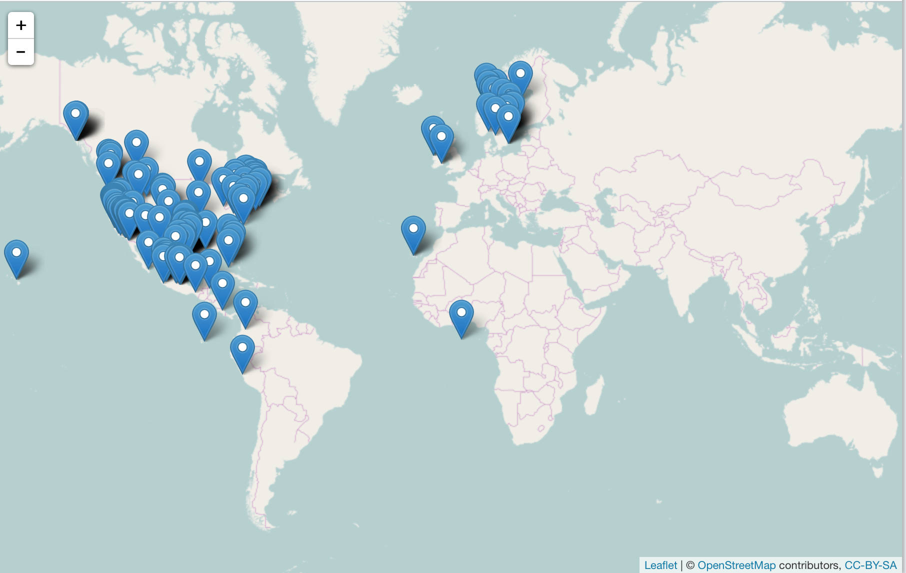
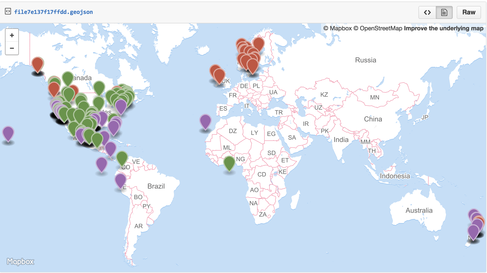
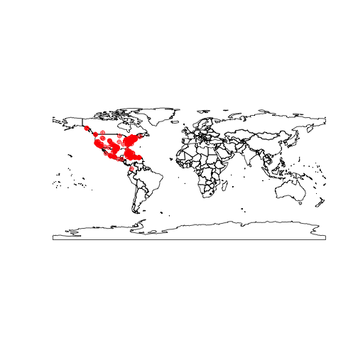
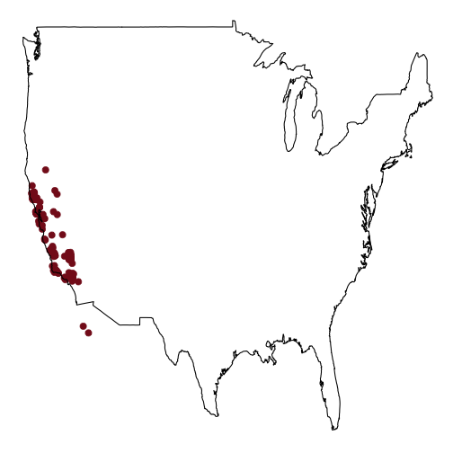
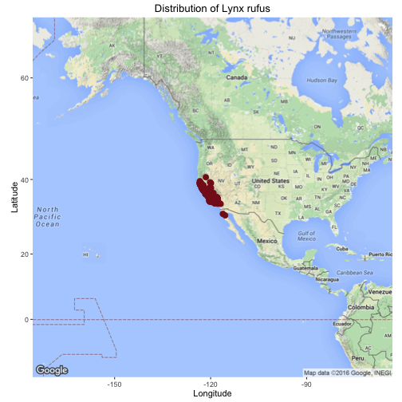

## mapping biodiversity data


## Load libraries


```r
library('rgbif')
library('spocc')
library('mapr')
```

## Interactive maps

### Leaflet.js

[Leaflet JS](http://leafletjs.com/) is an open source mapping library that can leverage various layers from multiple sources. Using the [`leaflet`](http://cran.rstudio.com/package=leaflet) library, we can generate a local interactive map of species occurrence data.

An example:


```r
spp <- c('Danaus plexippus','Accipiter striatus','Pinus contorta')
dat <- occ(query = spp, from = 'gbif', has_coords = TRUE, limit = 100)
map_leaflet(dat)
```



### Geojson map as a Github gist


```r
spp <- c('Danaus plexippus', 'Accipiter striatus', 'Pinus contorta')
dat <- occ(query = spp, from = 'gbif', has_coords = TRUE, limit = 100)
dat <- fixnames(dat)
map_gist(dat, color = c("#976AAE", "#6B944D", "#BD5945"))
```



## Static maps

### base plots

Base plots, or the built in plotting facility in R accessed via `plot()`, is quite fast, but not easy or efficient to use, but are good for a quick glance at some data.


```r
spnames <- c('Accipiter striatus', 'Setophaga caerulescens', 'Spinus tristis')
out <- occ(query = spnames, from = 'gbif', has_coords = TRUE, limit = 100)
map_plot(out, cex = 1, pch = 10)
```



### ggplot2

`ggplot2` is a powerful package for making visualizations in R. Read more about it [here](https://cran.rstudio.com/web/packages/ggplot2/).


```r
dat <- occ(query = 'Lynx rufus californicus', from = 'gbif', has_coords = TRUE, limit = 200)
map_ggplot(dat, map = "usa")
```



### ggmap

Using the `ggmap` package we can create a ggplot, but with map data behind the points.


```r
map_ggmap(dat)
```


