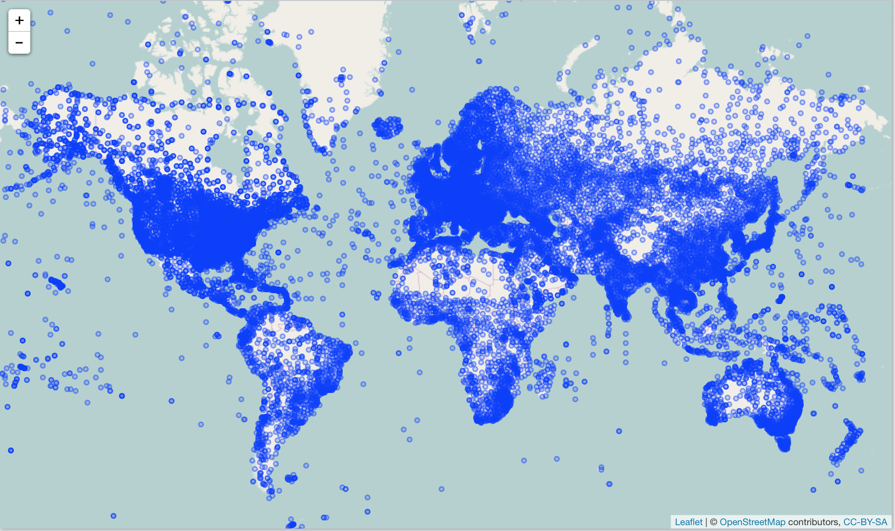

## Climate data - NOAA

rnoaa [https://github.com/ropensci/rnoaa](https://github.com/ropensci/rnoaa)

```{r}
if (!require("rnoaa")) install.packages("rnoaa")
library("rnoaa")
```

```{r eval=FALSE}
stations <- isd_stations()
head(stations)
library("leaflet")
leaflet(data = df) %>%
    addTiles() %>%
    addCircles()
```

## ISD stations



## Other NOAA data

* NOAA NCDC climate data
* Severe weather data
* [Sea ice data](ftp://sidads.colorado.edu/DATASETS/NOAA/G02135/shapefiles)
* [NOAA buoy data](http://www.ndbc.noaa.gov/)
* [ERDDAP data](http://upwell.pfeg.noaa.gov/erddap/index.html)
* Tornadoes! [NOAA Storm Prediction Center](http://www.spc.noaa.gov/gis/svrgis/)
* Historical Observing Metadata Repository - [NOAA NCDC](http://www.ncdc.noaa.gov/homr/api)
* [Int. Best Track Archive for Climate Stewardship (IBTrACS)](http://www.ncdc.noaa.gov/ibtracs/index.php?name=wmo-data)
* [GHCND FTP data](ftp://ftp.ncdc.noaa.gov/pub/data/noaa)
* [Global Ensemble Forecast System (GEFS) data](https://www.ncdc.noaa.gov/data-access/model-data/model-datasets/global-ensemble-forecast-system-gefs)
* [Extended Reconstructed Sea Surface Temperature (ERSST)](https://www.ncdc.noaa.gov/data-access/marineocean-data/extended-reconstructed-sea-surface-temperature-ersst-v4)
* [Argo buoys](http://www.argo.ucsd.edu/)
* [NOAA CO-OPS - tides and currents data](http://tidesandcurrents.noaa.gov/)

## New Zealand climate data

[clifro](https://github.com/ropensci/clifro)

## World Bank climate data

[rWBclimate](https://github.com/ropensci/rWBclimate)
